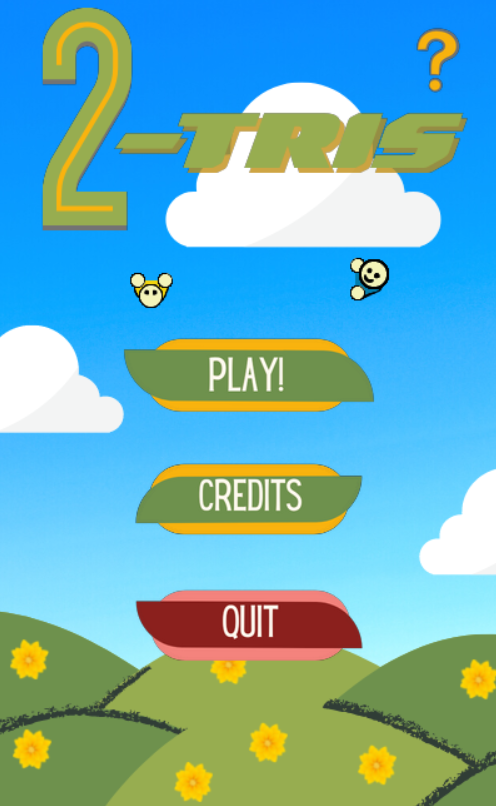
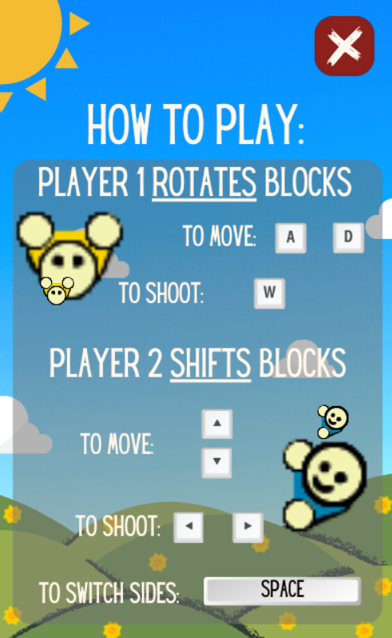
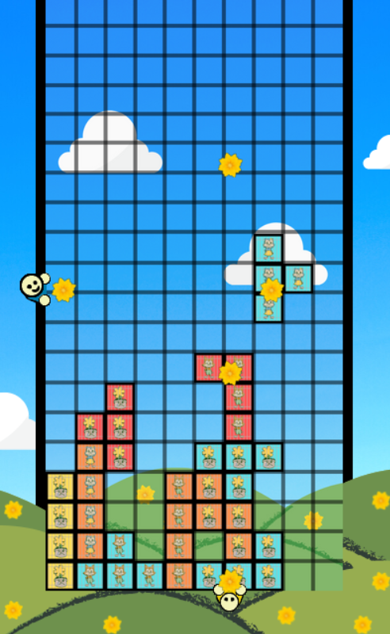
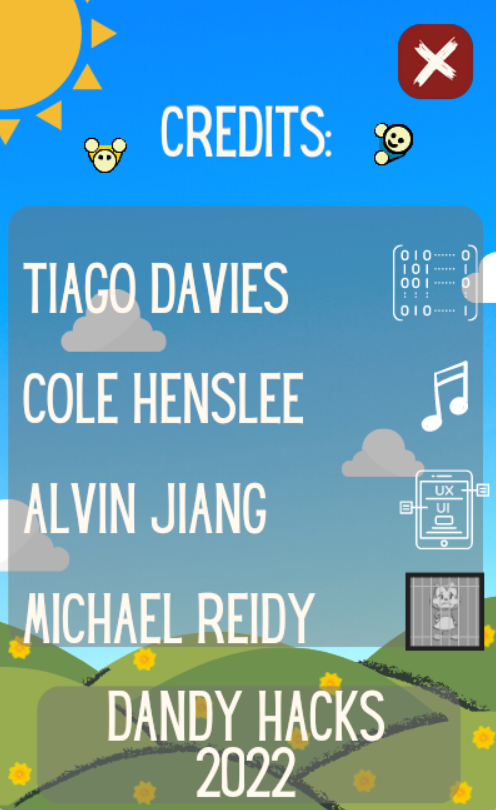

Download here: https://tdavies.itch.io/2-tris
Sound Track here: https://on.soundcloud.com/KHoHy

## Code Description
Coded in Python by Tiago Davies and Michael Reidy, using pygame library. Strong focus on Object Oriented Programming, with classes to define the individual block and then the overall piece. 

## Music Description
The sound track was composed by Cole Henslee, a George Eastman School of Music student. The music features 2 original pieces for the main menu and the game over screen. Additionally there is a piece that is the Tetris theme in a Viennese Waltz, which plays during the main gameplay.

## Project Timeline
We made this game for DandyHacks'22, which lasted 42 hours. Upon being judged by a panel we were awarded 1st place for video games, and also Best UI/UX

## Game Screenshots

